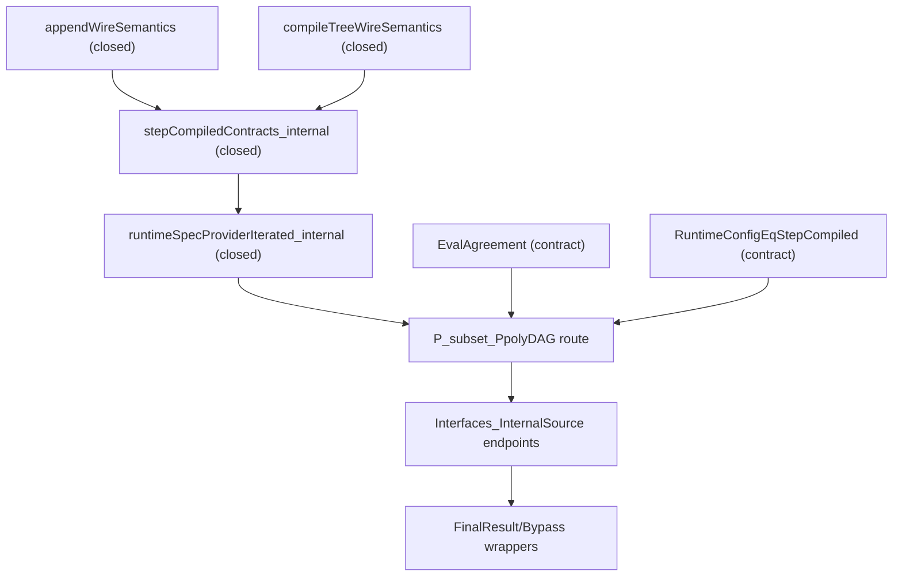

# Strategy: Closing Internal `P ⊆ PpolyDAG` in `pnp3`

Дата фиксации: 2026-03-02
Основа: deep-dive по ветке `khanukov/continue-step-10-in-psubsetppoly_internal_todo.md`
Статус: active runbook

Дополнение (2026-03-02):
- отдельный runbook для size-closure:
  `pnp3/Docs/CompiledRuntime_SizeClosure_Runbook.md`.
- текущая truth-table/tree-recompile форма `stepCompiled` признана
  архитектурным блокером для внутреннего polynomial size witness.

## 1. Цель

Довести текущий DAG-маршрут

- `P ⊆ PpolyDAG` (внутренний источник в `pnp3`)

до максимально закрытой формы, начиная с самого дешёвого по трудозатратам узла,
и только затем заходя в более глубокий рефактор симуляции.

## 2. Snapshot: что уже закрыто

1. Закрыты:
   - `appendWireSemantics`
   - `compileTreeWireSemantics`
2. Закрыт internal assembly:
   - `stepCompiledContracts_internal`
3. Есть рабочее условное замыкание в `P_subset_PpolyDAG` через контрактный bundle.
4. Targeted build проходит:
   - `TreeToStraight`, `Circuit_Compiler`, `FinalResult`, `Barrier/Bypass`.

## 3. Карта статусов (на момент фиксации)

| Узел | Статус | Комментарий |
|---|---|---|
| `appendWireSemantics` | closed | Без `sorry/admit`; собран из gate-right closure. |
| `compileTreeWireSemantics` | closed | Внутренне закрыт, используется в сборке контрактов. |
| `stepCompiledContracts_internal` | closed | Assumption-free witness для stepCompiled-path. |
| `runtimeSpecProviderIterated_internal` | closed | Итеративный runtime-spec есть внутри. |
| `RuntimeConfigEqStepCompiled` | open (contract) | Legacy bridge-контракт, не закрыт теоремой. |
| `EvalAgreement` | open (contract) | Семантический мост archive-eval ↔ internal-eval. |
| `proved_P_subset_PpolyDAG_of_iteratedContractsBridged` | working conditional | Работает, но параметризован bundle-контрактом. |
| `Interfaces_InternalSource` endpoints | working conditional | Экспортируют internal-source route с контрактом. |

## 4. Реальные блокеры

### B1. `EvalAgreement` (локальный семантический мост)

Сейчас в `Circuit_Compiler` это входной контракт:

- `InternalCompiler.EvalAgreement`

Смысл: согласовать семантику

- `ArchiveStraightLineAdapter.eval`
- `Internal.PsubsetPpoly.StraightLine.eval`.

Это локальная задача склейки семантик, без ломки архитектуры шага симуляции.

### B2. `RuntimeConfigEqStepCompiled` (архитектурный блокер)

Сейчас bridge требует:

- `RuntimeConfigEqStepCompiled`

но:

- `step` определён как identity (`sc`)
- `runtimeConfig` строится через итерацию `step`
- `stepCompiled` — отдельный «реальный» шаг.

Поэтому это не «дописать одну лемму», а вопрос архитектурного выравнивания маршрута.

### B3. `CompiledRuntimeCircuitSizeBound` (архитектурный блокер)

Для compiled-runtime route текущий one-step assembly идёт через
`toTreeWire -> compileTree/packFin`, а `ConfigCircuits.stepCircuits` в этой
версии строится через `truthTableCircuit`.

Следствие: polynomial witness для `runtimeConfigCompiled` не закрывается
надёжно без смены shape шага.

## 5. Приоритеты (что закрывать первым)

### P0 (новый критический): закрыть size-architecture compiled-runtime шага

Почему first:

1. Это главный блокер runtime-only no-contract closure.
2. Без него не закрывается `CompiledRuntimeCircuitSizeBound`.
3. `EvalAgreement` больше не является самым ранним критическим узлом.

### P1: закрыть `EvalAgreement`

Это still-needed узел, но уже после size-архитектуры.

### P2 (следом): убрать зависимость от `RuntimeConfigEqStepCompiled` через рефактор маршрута

Вместо прямого доказательства равенства конфигов:

1. Сделать route на основе итеративного `stepCompiled` основным.
2. Собирать компилятор/включение из уже закрытого iterated-runtime witness.
3. Держать старый `runtimeConfig`-маршрут как legacy-слой совместимости.

## 6. Рекомендуемый технический план

## Шаг A: size-closure refactor (`stepCompiledLinear`)

1. Ввести DAG-preserving one-step assembly для `StraightConfig`:
   append-only, без полного tree-recompile.
2. Доказать one-step gate-growth bound.
3. Поднять bound на `Nat.iterate` и закрыть:
   `CompiledRuntimeCircuitGateBound -> CompiledRuntimeCircuitSizeBound`.

Подробности зафиксированы в:
`pnp3/Docs/CompiledRuntime_SizeClosure_Runbook.md`.

## Шаг B: закрыть `EvalAgreement`

1. Добавить bridge-леммы sem→sem:
   - из `ArchiveStraightLineAdapter.eval C x` к `DagCircuit.eval (toDag C) x` (уже rfl-side),
   - из internal `StraightLine.eval` к той же нормальной форме (через `toDag` или эквивалентный intermediate).
2. Свести обе стороны к одной нормальной форме и закрыть theorem:
   - `evalAgreement_internal : InternalCompiler.EvalAgreement`.
3. Подключить его в contract bundle helpers как default witness.

## Шаг C: internalize runtime route без `RuntimeConfigEqStepCompiled`

1. В `Circuit_Compiler` ввести primary theorem/def, опирающийся только на:
   - `RuntimeSpecProviderIterated`
   - `EvalAgreement`.
2. Для старого API оставить обёртку через bridge-форму, но не как default source.
3. Финальные wrappers (`FinalResult`, `Barrier.Bypass`) перевести на новый default bundle.

## Шаг D: cleanup интерфейса

1. Явно отметить в `Interfaces_InternalSource` и финальных wrappers:
   - default route = iterated internal source.
2. Свести legacy-пути к compatibility aliases.

## 7. Definition of Done

Считаем этап закрытым, когда одновременно:

1. Есть закрытый внутренний witness `CompiledRuntimeCircuitSizeBound`.
2. Есть закрытый внутренний witness `EvalAgreement`.
3. Default DAG-route не требует `RuntimeConfigEqStepCompiled`.
4. Final wrappers используют internal-source default route.
5. `lake build` проходит (минимум: ключевые модули + полный build).
6. Нет новых `axiom/sorry/admit` в этом треке.

## 8. Риски

1. Риск «скрытой зависимости от старого пути»:
   - нужен явный grep/audit call-sites после перевода default route.
2. Риск регрессии интерфейсов:
   - legacy API оставлять до стабилизации downstream.
3. Риск расползания статусов по документам:
   - синхронизировать этот файл с `PsubsetPpoly_Internal_TODO.md`.

## 9. Проверки после каждого этапа

```bash
lake build pnp3/Complexity/PsubsetPpolyInternal/TreeToStraight.lean
lake build pnp3/Complexity/Simulation/Circuit_Compiler.lean
lake build pnp3/Magnification/FinalResult.lean pnp3/Barrier/Bypass.lean
lake build
```

## 10. Dependency Map



## 11. CI gates (включать после закрытия internal theorem)

Когда появится безаргументный endpoint, добавить hard-gate:

1. `pnp3/Tests/Step10NoContracts.lean` с проверкой наличия:
   - `#check proved_P_subset_PpolyDAG_internal`
2. build-gate в CI:
   - `lake env lean pnp3/Tests/Step10NoContracts.lean`
3. axiom-surface audit:
   - `#print axioms proved_P_subset_PpolyDAG_internal`
   и проверка на неожиданные зависимости.

## 12. Решение по стратегии (фиксируем)

Принято для реализации:

1. Сначала закрываем size-architecture compiled-runtime шага.
2. Затем закрываем `EvalAgreement`.
3. Затем убираем `RuntimeConfigEqStepCompiled` из default-route через итеративный маршрут.
