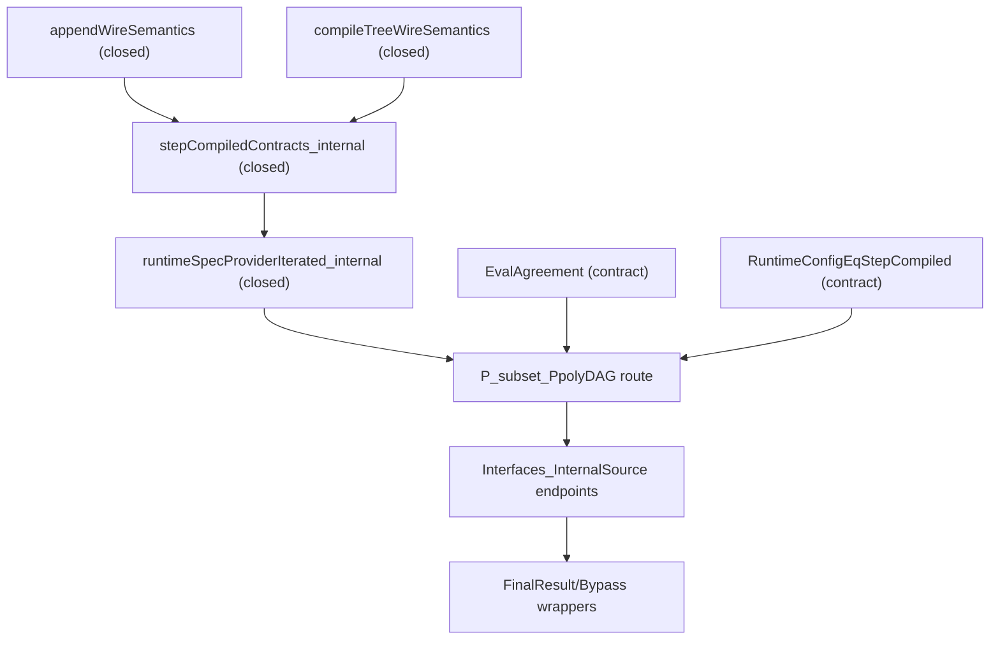

# Strategy: Closing internal `P ⊆ PpolyDAG` in `pnp3`

> **STALE NAMES (2026-05-29).** The inclusion is closed
> (`proved_P_subset_PpolyDAG_internal`), and the compiled-tree / truth-table
> declarations this strategy analyses (`stepCompiled`, `stepCompiledTruthTable`,
> `runtimeConfigCompiled`, `appendWireSemantics`, …) have since been **removed
> as dead code** (superseded by the linear *candidate* route).  This file is
> retained only as historical strategy notes; for the current inclusion-side
> status use `PsubsetPpoly_Internal_TODO.md`,
> `PsubsetPpoly_AUDITOR_CHECKLIST.md`, and `Simulation_FineGrained_Status.md`.

Pinned date: 2026-03-02
Basis: deep-dive on the branch
`khanukov/continue-step-10-in-psubsetppoly_internal_todo.md`
Status: active runbook

> Current-scope note (2026-04-03):
> this file describes only the historical / architectural inclusion-side
> strategy.  For the repository-wide status use the top-level docs.

> Release note (2026-03-14):
> this document records the strategic / historical deep-dive layer.
> For the current release snapshot (active route, verified endpoints,
> audit checks) use:
> `pnp3/Docs/PsubsetPpoly_Internal_TODO.md`,
> `pnp3/Docs/PsubsetPpoly_AUDIT_HANDOFF.md`,
> `pnp3/Docs/PsubsetPpoly_AUDITOR_CHECKLIST.md`.
>
> Update (2026-03-14 cleanup):
> the `InternalCompiler/*` compatibility layer and the `EvalAgreement`
> branch have been removed from the active `Circuit_Compiler.lean`;
> mentions of those nodes below are historical.

Addendum (2026-03-02):
- a separate size-closure runbook lives at
  `pnp3/Docs/CompiledRuntime_SizeClosure_Runbook.md`;
- the current truth-table / tree-recompile shape of `stepCompiled` is
  recognised as an architectural blocker for an internal polynomial
  size witness.

## Update (2026-03-13): status after full recheck

Verified on the current tree:

- `./scripts/check.sh` passes.
- The current audit / regression tests compile
  (`AxiomsAudit`, `BarrierAudit`, `BarrierBypassAudit`,
  `BridgeLocalityRegression`).
- Targeted builds of `Simulation/Circuit_Compiler/FinalResult/Bypass`
  pass.

What changed relative to this runbook's baseline:

1. An internal one-step provider on the linear-candidate branch was
   closed: `stepCompiledLinearCandidateStepSpecProvider_internal`.
2. The internal linear correctness witness was closed:
   `compiledRuntimeAcceptCorrectnessLinear_internal`.
3. In the compiled-runtime route, the contract
   `CompiledRuntimeAcceptCorrectness` was removed from the minimal
   residual surface (correctness is now closed by the internal
   theorem).
4. A no-arg output-wire witness was closed:
   `compiledAcceptOutputWireAgreementLinear_internal`.
5. The no-arg endpoint was assembled:
   `proved_P_subset_PpolyDAG_internal : P_subset_PpolyDAG`.

After this stage, what remains is not inclusion wiring but a separate
DAG-separation blocker (`NP_not_subset_PpolyDAG`) on the final route.

Note: the table and steps below are still useful as a detailed
architectural log, but the current blocker summary is determined by
this update.

## 1. Goal

Bring the current DAG route

- `P ⊆ PpolyDAG` (internal source inside `pnp3`)

to a maximally closed form, starting with the cheapest node and only
then entering a deeper simulation refactor.

## 2. Snapshot: what is already closed

1. Closed:
   - `appendWireSemantics`
   - `compileTreeWireSemantics`
2. Internal assembly closed:
   - `stepCompiledContracts_internal`
3. A working conditional closure of `P_subset_PpolyDAG` via the
   contract bundle exists.
4. Targeted builds pass:
   - `TreeToStraight`, `Circuit_Compiler`, `FinalResult`,
     `Barrier/Bypass`.

## 3. Status map (at the time of pinning)

| Node | Status | Comment |
|---|---|---|
| `appendWireSemantics` | closed | No `sorry/admit`; built from a gate-right closure. |
| `compileTreeWireSemantics` | closed | Closed internally, used in contract assembly. |
| `stepCompiledContracts_internal` | closed | Assumption-free witness for the stepCompiled path. |
| `runtimeSpecProviderIterated_internal` | closed | Iterative runtime-spec is internal. |
| `RuntimeConfigEqStepCompiled` | open (contract) | Legacy bridge contract, not closed by a theorem. |
| `EvalAgreement` | open (contract) | Semantic bridge archive-eval ↔ internal-eval. |
| `proved_P_subset_PpolyDAG_of_iteratedContractsBridged` | working conditional | Works but is parameterised by the contract bundle. |
| `Interfaces_InternalSource` endpoints | working conditional | Expose the internal-source route with a contract. |

## 4. Actual blockers

### B1. `EvalAgreement` (local semantic bridge)

In `Circuit_Compiler` this is currently an input contract:

- `InternalCompiler.EvalAgreement`.

Meaning: reconcile the semantics of

- `StraightLineAdapter.eval`
- `Internal.PsubsetPpoly.StraightLine.eval`.

This is a local semantic-gluing task; it does not break the
simulation-step architecture.

### B2. `RuntimeConfigEqStepCompiled` (architectural blocker)

The bridge currently requires:

- `RuntimeConfigEqStepCompiled`,

but:

- `step` is defined as identity (`sc`);
- `runtimeConfig` is built by iterating `step`;
- `stepCompiled` is a separate "real" step.

So this is not "finish one lemma" — it is an architectural alignment
question for the route.

Technical pinning of the cause (per the current code):

1. `runConfig` / `runtimeConfig` rely on iterating `step`.
2. `step` is currently identity, hence `runtimeConfig_eq_initial`.
3. `stepCompiled` is defined separately (`stepCompiledTruthTable`) and
   does not match the identity step.

Consequence: the `RuntimeConfigEqStepCompiled` bridge cannot be closed
without changing the runtime model; this directly blocks the no-arg
closure for the inclusion route.

### B3. `CompiledRuntimeCircuitSizeBound` (architectural blocker)

For the compiled-runtime route, the current one-step assembly goes
through `toTreeWire -> compileTree / packFin`, and
`ConfigCircuits.stepCircuits` is built via `truthTableCircuit` in this
version.

Consequence: a polynomial witness for `runtimeConfigCompiled` cannot be
closed reliably without changing the step shape.

## 5. Priorities (what to close first)

### P0 (new critical): close the size architecture of the compiled-runtime step

Why first:

1. This is the main blocker for the runtime-only no-contract closure.
2. Without it `CompiledRuntimeCircuitSizeBound` does not close.
3. `EvalAgreement` is no longer the earliest critical node.

### P1: close `EvalAgreement`

Still-needed node, but only after the size architecture.

### P2 (next): remove the dependency on `RuntimeConfigEqStepCompiled` via a route refactor

Instead of proving config equality directly:

1. Make the route based on iterative `stepCompiled` the main route.
2. Assemble the compiler / inclusion from the already-closed
   iterated-runtime witness.
3. Keep the old `runtimeConfig` route as a legacy compatibility layer.

## 6. Recommended technical plan

## Step A: size-closure refactor (`stepCompiledLinear`)

1. Introduce a DAG-preserving one-step assembly for `StraightConfig`:
   append-only, without a full tree recompile.
2. Prove a one-step gate-growth bound.
3. Lift the bound to `Nat.iterate` and close:
   `CompiledRuntimeCircuitGateBound -> CompiledRuntimeCircuitSizeBound`.

Details are recorded in:
`pnp3/Docs/CompiledRuntime_SizeClosure_Runbook.md`.

## Step B: close `EvalAgreement`

1. Add sem→sem bridge lemmas:
   - from `StraightLineAdapter.eval C x` to
     `DagCircuit.eval (toDag C) x` (already rfl-side);
   - from internal `StraightLine.eval` to the same normal form
     (through `toDag` or an equivalent intermediate).
2. Reduce both sides to a single normal form and close the theorem:
   - `evalAgreement_internal : InternalCompiler.EvalAgreement`.
3. Wire it into the contract bundle helpers as a default witness.

## Step C: internalise the runtime route without `RuntimeConfigEqStepCompiled`

1. In `Circuit_Compiler` introduce a primary theorem / def that
   depends only on:
   - `RuntimeSpecProviderIterated`;
   - `EvalAgreement`.
2. Keep the old API as a wrapper around the bridge form, but not as
   the default source.
3. Move the final wrappers (`FinalResult`, `Barrier.Bypass`) to the
   new default bundle.

Pass criterion for Step C:

1. A no-arg `RuntimeSpecProvider` exists (without
   `RuntimeConfigEqStepCompiled`).
2. A no-arg endpoint `proved_P_subset_PpolyDAG_internal` exists.
3. The default DAG route no longer needs an inclusion-contract
   argument.

## Step D: interface cleanup

1. Mark explicitly in `Interfaces_InternalSource` and the final
   wrappers: default route = iterated internal source.
2. Reduce the legacy paths to compatibility aliases.

## 7. Definition of Done

The stage is considered closed when all of the following hold at once:

1. There is a closed internal witness `CompiledRuntimeCircuitSizeBound`.
2. There is a closed internal witness `EvalAgreement`.
3. The default DAG route does not require
   `RuntimeConfigEqStepCompiled`.
4. The final wrappers use the internal-source default route.
5. `lake build` passes (minimum: the key modules plus a full build).
6. No new `axiom/sorry/admit` are introduced in this track.

## 8. Risks

1. Risk of a "hidden dependency on the old path":
   - an explicit `grep` / audit of call sites is needed after the
     default route switch.
2. Interface regression risk:
   - keep the legacy API until downstream stabilises.
3. Risk of status drift across documents:
   - keep this file in sync with `PsubsetPpoly_Internal_TODO.md`.

## 9. Checks after each stage

```bash
lake build pnp3/Complexity/PsubsetPpolyInternal/TreeToStraight.lean
lake build pnp3/Complexity/Simulation/Circuit_Compiler.lean
lake build pnp3/Magnification/FinalResultCore.lean pnp3/Barrier/Bypass.lean
lake build
```

## 10. Dependency map



## 11. CI gates (turn on after the internal theorem is closed)

Once the no-argument endpoint exists, add a hard gate:

1. `pnp3/Tests/AxiomsAudit.lean` with a check for the presence of:
   - `#print axioms proved_P_subset_PpolyDAG_internal`.
2. Build gate in CI:
   - `lake env lean pnp3/Tests/AxiomsAudit.lean`.
3. Axiom-surface audit:
   - `#print axioms proved_P_subset_PpolyDAG_internal` and a check for
     unexpected dependencies.

## 12. Strategy decision (pinned)

Adopted for implementation:

1. First close the size architecture of the compiled-runtime step.
2. Then close `EvalAgreement`.
3. Then remove `RuntimeConfigEqStepCompiled` from the default route
   via the iterative route.
